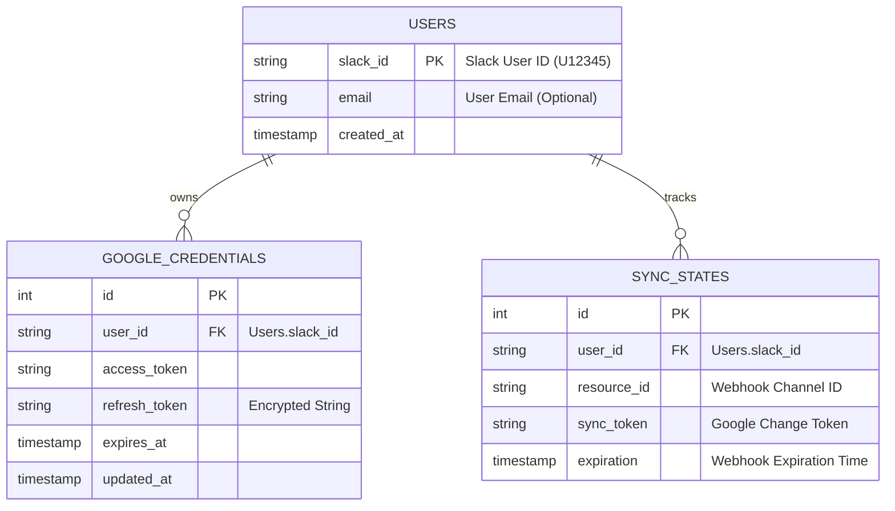

# SPEC-001: System Specification (Schema & API)

**Version**: 1.0
**Date**: 2026-01-09
**Status**: DRAFT
**References**: DO-001 (Architecture Strategy)

---

## 1. Introduction
본 문서는 DO-001에서 결정된 아키텍처(Simplified DDD + Webhook)를 바탕으로, MVP 단계의 구체적인 **데이터베이스 스키마**, **API 엔드포인트**, **디렉토리 구조**를 정의합니다.

---

## 2. Directory Structure (Module Design)

```
proactive_manager/
├── app/
│   ├── api/
│   │   ├── routes/         # Router (Entry Points)
│   │   │   ├── auth.py     # GET /auth/google/*
│   │   │   └── webhooks.py # POST /webhook/google/*
│   │   └── dependencies.py # Dependency Injection (DB Session etc)
│   ├── core/
│   │   ├── config.py       # Secrets & Settings
│   │   └── security.py     # Token Encryption Utils
│   ├── db/
│   │   ├── models.py       # SQLAlchemy Models
│   │   └── session.py      # Async Database Engine
│   ├── services/           # Service Layer (Business Logic)
│   │   ├── calendar_service.py # Google API + Sync Logic
│   │   ├── slack_service.py    # Formatting & Messaging
│   │   └── user_service.py     # User & Token Management
│   └── main.py             # FastAPI App Factory
├── tests/                  # Pytest
├── alembic/                # DB Migrations
├── docker-compose.yml
└── pyproject.toml
```

---

## 3. Database Schema (PostgreSQL)

### 3.1 ER Diagram
사용자 인증 정보와 캘린더 동기화 상태를 관리하기 위한 최소 모델입니다.



---

## 4. API Endpoint Specification

### 4.1 Authentication (Internal)
*   **GET /auth/google/login**
    *   **Query**: `slack_user_id`
    *   **Response**: 302 Redirect (Google OAuth Consent Screen)
*   **GET /auth/google/callback**
    *   **Query**: `code`, `state` (slack_user_id)
    *   **Description**: Code를 Token으로 교환하고 Encrypted Storage에 저장.

### 4.2 Webhooks (External)
*   **POST /webhook/google/calendar**
    *   **Headers**: 
        *   `X-Goog-Channel-ID`: DB의 `resource_id`와 매치되는지 검증.
        *   `X-Goog-Resource-State`: `sync` (초기안부), `exists` (변경발생).
    *   **Body**: Empty (Google은 변경 사실만 알림).
    *   **Action**: `calendar_service.sync_events(user_id)` 트리거 (Background Task).

---
